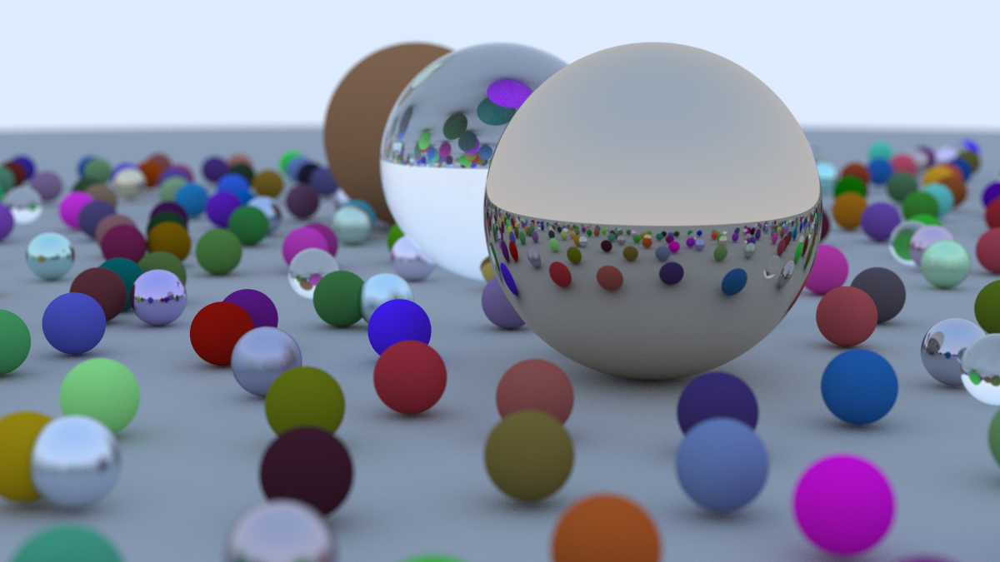

# cpp_raytracer
A simple raytracer (pathtracer), coded in modern C++, following various tutorials:
- [_Introduction to Raytracing: A Simple Method for Creating 3D Images_](https://scratchapixel.com/lessons/3d-basic-rendering/introduction-to-ray-tracing/how-does-it-work.html)
- The [_Ray Tracing in One Weekend_ series](https://raytracing.github.io/)
- [_Physically Based Rendering: From Theory to Implementation_, 4th edition](https://pbr-book.org/4ed/contents)
- [_Computer Graphics from Scratch_ by Gabriel Gambetta](https://gabrielgambetta.com/computer-graphics-from-scratch/)

Some images rendered by this raytracer:

